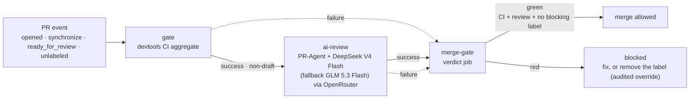

# AI review & merge gate

Org-wide AI pull-request review and merge gating, built on
[PR-Agent](https://github.com/the-pr-agent/pr-agent) with models routed
through [OpenRouter](https://openrouter.ai). The machinery lives in this
repository (`devtools`); consumer repositories carry a thin pipeline
workflow and get the whole chain.

## How it works

One **pull_request-triggered pipeline** per consumer repository chains
three reusable-workflow jobs with `needs` — no `workflow_run`, no event
hop, no context loss (the caller's pull_request event flows through
`github.event` into every callee):

1. **`gate`** — the devtools CI aggregate (build + tests). Unchanged from
   the pre-AI era.
2. **`ai-review`** — runs only if CI succeeded and the PR is not a draft.
   PR-Agent posts one persistent review comment, adds labels
   (`Review effort x/5`, `Possible security concern`) and a merge
   recommendation. Zero model spend on drafts and on red CI.
3. **`merge-gate`** — a plain job (its check run is the required status
   check) that fails unless all three conditions hold:
   1. CI result is `success`
   2. AI review result is `success` — the review completed, not merely
      "the step exited 0" (see *Failure visibility*)
   3. no blocking label on the PR

Blocking labels (default): `Possible security concern` (set by the review)
and `size: too-big` (more than 1000 added lines excluding generated/lock
files, or the 3000-file API cap — set by `pr-meta`).

PR-Agent only ever creates `Review effort x/5` and `Possible security
concern`; every other label below comes from `pr-meta`.

### PR labels

`pr-meta` classifies every PR on two axes. Names read `<family>: <value>`:

| Label | Meaning |
|---|---|
| `size: XS` … `size: XL` | lines a reviewer must read (added lines, minus lock/build/test/docs) |
| `size: too-big` | above the review-effort limit — **blocks the merge** |
| `risk: low` | docs, tests or comments only |
| `risk: normal` | no risk signal detected |
| `risk: high` | trust boundary, migration, deploy or config |
| `urgent` | opted in by a `hotfix/*` branch, a `fix` title, or the label itself |

`requires-human-review` is added where the repo carries a
`.github/trust-boundary.yml`.

**Override** (deliberate, audited): remove the blocking label — the
`unlabeled` event re-fires the pipeline, the gate turns green, and the
removal stays visible in the PR history.

## Failure visibility

`CONFIG.PROPAGATE_TOOL_ERRORS=true` makes a tool error fail the job
instead of exiting 0. PR-Agent's default (`propagate_tool_errors=false`)
catches the exception internally, publishes a `Failed to generate ...`
comment, and returns normally — so before this setting a broken reviewer
(invalid key, unreachable model) produced a green `ai-review` check on
every PR, and a green `merge-gate` behind it. The failure was visible only
to whoever read the run log.

With it on:

- a failed review fails `ai-review`, and `merge-gate` fails with it — a
  broken reviewer blocks merges instead of silently approving them;
- a transient provider outage blocks the PR too. That is deliberate:
  re-run the failed job (or push) once the provider recovers, rather than
  merging on an unread PR. A green check must mean the review ran.

## Prerequisites

- Secret `AI_REVIEW_OPENROUTER_API_KEY`, defined **org-wide** (org →
  Settings → Secrets and variables → Actions). One org secret serves
  every consumer, public or private: the org is on GitHub **Team**,
  where org secrets reach private repositories. Do **not** add a
  per-repo copy — a repo-level secret always overrides the org value
  (GitHub precedence is fixed), silently pinning that repo to whatever
  key was copied. `scripts/sync-repo-secrets.sh` remains only for a
  deliberate per-repo override.
- Ruleset-based branch protection on `main`, enforced org-wide:
  `main-protection` (pull request required) plus `required-ci-checks`,
  which makes **`ci / gate`** and **`merge-gate`** required status
  checks on the default branch. Enforcement is **active and blocking**
  (rulesets work on private repositories; the org is on Team), with no
  bypass actor on the org rulesets. A repo-level trust-boundary ruleset
  adds code-owner review — 1 approving review on `devtools`
  (`* @Oloompa`).
- CODEOWNERS covering `.github/workflows/**`: the pipeline file is taken
  from the PR's merge commit, so workflow edits must require code-owner
  review (the trust-boundary bot flags them).

## Setup a new repository

1. Copy the pipeline boilerplate from `repo-template`
   (`.github/workflows/pr-pipeline.yml`) — three jobs, ~40 lines, one
   `@<digest>` pin to bump with `make devtools-update`.
2. Add `.pr_agent.toml` at the repo root: `restricted_mode = true`,
   `persistent_comment = true`, `require_merge_recommendation = true`,
   and chill-profile `extra_instructions` anchored on the repo's
   `AGENTS.md` (fed to the reviewer automatically).
3. The key needs no setup: the org secret
   `AI_REVIEW_OPENROUTER_API_KEY` is inherited automatically (org secrets
   reach private repos on the Team plan). Add a repo-level secret only
   for a deliberate per-repo override.
4. The org rulesets already require `ci / gate` and `merge-gate` on the
   default branch — no per-repo setup unless the repo needs an extra
   rule (e.g. a trust-boundary code-owner rule).

## Merging: triage the findings

Green checks mean the review **ran** — never that its findings were
addressed. Before merging a PR, every review thread must be triaged:
fixed, or replied to with a justification and resolved. The agent's
`gh pr merge` calls are mechanically gated by the `merge-review-gate`
hook (agent-conventions), which blocks a merge while unresolved review
threads exist — the merge request is retried after the triage.

## Model A/B

Change the `model` input in the consumer's pipeline file (one line) and
push — the next PR is reviewed with the new model. Default:
`openrouter/deepseek/deepseek-v4-flash` (~$0.08/$0.17 per Mtok,
observed $0.0006/review on a small docs PR), fallback:
`openrouter/z-ai/glm-5.3-flash`.

## Troubleshooting

| Symptom | Cause |
|---|---|
| Run `startup_failure`, no logs | The called workflow file is rejected by GitHub's parser, or the caller does not grant the permissions the callee declares. The called workflow's token is the *intersection* of the caller grant and the callee declaration — `checks: write` / `issues: write` / `pull-requests: write` must be present at both levels. |
| `Resource not accessible by integration (HTTP 403)` | Missing permission in the caller's grant for the publishing job. |
| `Could not read persistent review state ... exit 1` | `persistent_finding_state` needs a verifiable GitHub user identity; it is disabled org-wide via env (`PR_REVIEWER.PERSISTENT_FINDING_STATE=false`). |
| `.pr_agent.toml` change has no effect | The file is read from the repo's **default branch** only — merge it first. |
| PR hangs on "Expected" for a required check | A skipped job that is a reusable-workflow **call** creates no check run. Required checks must be plain jobs (the `merge-gate` design) — never make a required check a skippable `uses:` job. |
| A failed review left the check green | Fixed 2026-09-14: `CONFIG.PROPAGATE_TOOL_ERRORS=true` (see *Failure visibility*). Before it, PR-Agent swallowed the error and the job exited 0. Every consumer must bump its `@<digest>` pin to pick the fix up. |
