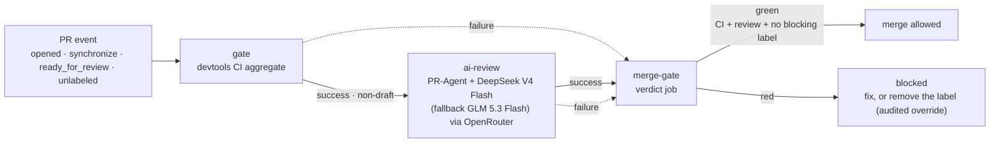

# AI review & merge gate

Org-wide AI pull-request review and merge gating, built on
[PR-Agent](https://github.com/the-pr-agent/pr-agent) with models routed
through [OpenRouter](https://openrouter.ai). The machinery lives in this
repository (`devtools`); consumer repositories carry a thin pipeline
workflow and get the whole chain.

## How it works

One **pull_request-triggered pipeline** per consumer repository chains
three reusable-workflow jobs with `needs` — no `workflow_run`, no event
hop, no context loss (the caller's pull_request event flows through
`github.event` into every callee):

1. **`gate`** — the devtools CI aggregate (build + tests). Unchanged from
   the pre-AI era.
2. **`ai-review`** — runs only if CI succeeded and the PR is not a draft.
   PR-Agent posts one persistent review comment, adds labels
   (`review effort x/5`, `possible security issue`) and a merge
   recommendation. Zero model spend on drafts and on red CI.
3. **`merge-gate`** — a plain job (its check run is the required status
   check) that fails unless all three conditions hold:
   1. CI result is `success`
   2. AI review result is `success`
   3. no blocking label on the PR

Blocking labels (default): `possible security issue` (set by the review)
and `size/too-big` (more than 1000 added lines excluding generated/lock
files, or the 3000-file API cap — set by `pr-meta`).

**Override** (deliberate, audited): remove the blocking label — the
`unlabeled` event re-fires the pipeline, the gate turns green, and the
removal stays visible in the PR history.

## Prerequisites

- Secret `AI_REVIEW_OPENROUTER_API_KEY` (repo-level; the
  `scripts/sync-repo-secrets.sh` helper fills it from the local store).
- Classic branch protection on `main` (rulesets do not enforce on
  private repos under the Free plan): require a pull request, 1
  approval with dismiss-stale, and the required status check
  **`merge-gate`**.
  **Current org stance — advisory mode (Free plan):** branch protection
  is not available on private repositories at all under the Free plan
  (the API answers 403 "Upgrade to GitHub Pro or make this repository
  public"), so the checks are *advisory*: `merge-gate` red is a signal,
  not a technical wall — a human can still merge. Upgrading the org to
  GitHub Team (~$4/user/month) makes the gate genuinely blocking and
  also unlocks org-level secrets for private repos and managed rulesets.
- CODEOWNERS covering `.github/workflows/**`: the pipeline file is taken
  from the PR's merge commit, so workflow edits must require code-owner
  review (the trust-boundary bot flags them).
- CODEOWNERS covering `.github/workflows/**`: the pipeline file is taken
  from the PR's merge commit, so workflow edits must require code-owner
  review (the trust-boundary bot flags them).

## Setup a new repository

1. Copy the pipeline boilerplate from `repo-template`
   (`.github/workflows/pr-pipeline.yml`) — three jobs, ~40 lines, one
   `@<digest>` pin to bump with `make devtools-update`.
2. Add `.pr_agent.toml` at the repo root: `restricted_mode = true`,
   `persistent_comment = true`, `require_merge_recommendation = true`,
   and chill-profile `extra_instructions` anchored on the repo's
   `AGENTS.md` (fed to the reviewer automatically).
3. Set the repo secret `AI_REVIEW_OPENROUTER_API_KEY`
   (`scripts/sync-repo-secrets.sh`).
4. Extend the branch protection rule with the `merge-gate` required
   check.

## Merging: triage the findings

Green checks mean the review **ran** — never that its findings were
addressed. Before merging a PR, every review thread must be triaged:
fixed, or replied to with a justification and resolved. The agent's
`gh pr merge` calls are mechanically gated by the `merge-review-gate`
hook (agent-conventions), which blocks a merge while unresolved review
threads exist — the merge request is retried after the triage.

## Model A/B

Change the `model` input in the consumer's pipeline file (one line) and
push — the next PR is reviewed with the new model. Default:
`openrouter/deepseek/deepseek-v4-flash` (~$0.08/$0.17 per Mtok,
observed $0.0006/review on a small docs PR), fallback:
`openrouter/z-ai/glm-5.3-flash`.

## Troubleshooting

| Symptom | Cause |
|---|---|
| Run `startup_failure`, no logs | The called workflow file is rejected by GitHub's parser, or the caller does not grant the permissions the callee declares. The called workflow's token is the *intersection* of the caller grant and the callee declaration — `checks: write` / `issues: write` / `pull-requests: write` must be present at both levels. |
| `Resource not accessible by integration (HTTP 403)` | Missing permission in the caller's grant for the publishing job. |
| `Could not read persistent review state ... exit 1` | `persistent_finding_state` needs a verifiable GitHub user identity; it is disabled org-wide via env (`PR_REVIEWER.PERSISTENT_FINDING_STATE=false`). |
| `.pr_agent.toml` change has no effect | The file is read from the repo's **default branch** only — merge it first. |
| PR hangs on "Expected" for a required check | A skipped job that is a reusable-workflow **call** creates no check run. Required checks must be plain jobs (the `merge-gate` design) — never make a required check a skippable `uses:` job. |
