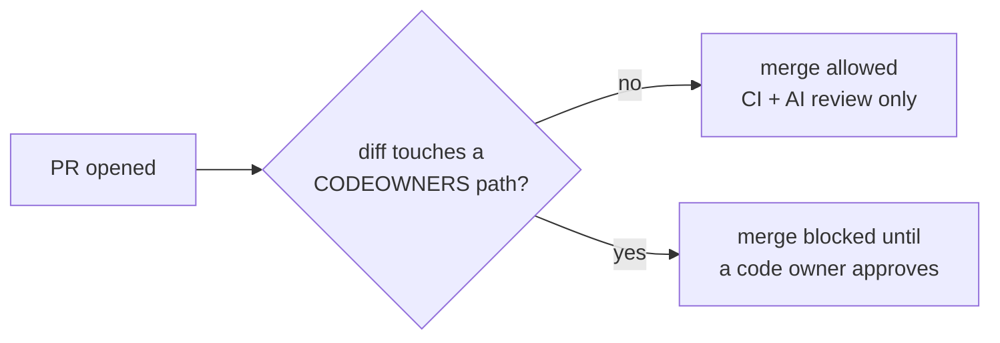

# CODEOWNERS trust-boundary pattern

How ostara-labs gates human review on trust-boundary paths without
slowing down normal PRs: a path-scoped `.github/CODEOWNERS` plus a
repository ruleset that requires code-owner review.



## Philosophy

Two classes of PRs, two gates:

- **Normal PRs** — code, docs, dependency bumps. They merge without a
  mandatory human approval; the CI + AI-review chain is the gate.
- **Trust-boundary PRs** — paths that constrain the agent itself (CI
  pipelines, hooks, dependency policy, security governance). They
  require an **explicit approval from a listed owner** before merge.

The boundary is expressed as **paths**: a PR crosses it exactly when its
diff touches a protected path. Nothing to label, nothing to remember.

## Why CODEOWNERS + ruleset

GitHub cannot condition merges on labels natively — a label is metadata,
not a merge gate. The two obvious alternatives fail:

- **Label-based blocking** (`requires-human-review`): anyone with write
  access can remove the label, including the agent. Nothing mechanically
  prevents a merge once it is gone.
- **Red CI as the block**: a failing check does block a merge, but it
  conflates "the code is broken, fix it" with "a human must look at
  this". The agent's reflex on red CI is to fix and re-push — the wrong
  response to a trust-boundary PR, and it trains the agent to treat the
  gate as an obstacle rather than a boundary.

Path-based code-owner review is the **native, race-free** mechanism:
GitHub evaluates the diff against CODEOWNERS at merge time and refuses
the merge until a code owner approves. No label to remove, no check to
game, no race between classification and merge. The
`requires-human-review` label can stay as a human-facing signal — the
ruleset is the enforcement.

## The recipe

1. **`.github/CODEOWNERS`** — list the trust-boundary paths with their
   owner:

   ```
   /.github/workflows/            @Oloompa
   /.github/trust-boundary.yml    @Oloompa
   /.github/CODEOWNERS            @Oloompa   # self-protecting
   ```

   Include the CODEOWNERS file itself: otherwise a PR could shrink the
   boundary without review.

2. **Repository ruleset** on the default branch:

   | Field | Value |
   |---|---|
   | Name | `trust-boundary-codeowner-review` |
   | Target | branch, `~DEFAULT_BRANCH` |
   | Rule | `pull_request` |
   | `required_approving_review_count` | `0` |
   | `require_code_owner_review` | `true` |
   | `dismiss_stale_reviews_on_push` | `true` |
   | Bypass | User `Oloompa` only |

   `required_approving_review_count: 0` + `require_code_owner_review:
   true` means: no blanket approval requirement, but any PR touching a
   CODEOWNERS path needs the owner's approval. Normal PRs stay
   friction-free.

   **Bypass is the owner only — agents get no bypass.** The bypass actor
   is the owner's escape hatch, not a convenience for automation.

3. **Live example**: `ostara-labs/bot` — ruleset `23108069`
   (`trust-boundary-codeowner-review`) + `.github/CODEOWNERS` mirroring
   `.github/trust-boundary.yml` (the classification config read by
   `pr-classify.yml`).

## devtools' own variant

`ostara-labs/devtools` is the **hub**: its hooks, CI workflows and
configs constrain every other repo in the org. Weakening devtools
weakens enforcement everywhere, so the hub is stricter:

- Ruleset `trust-boundary-human-review` (`23100388`) requires
  `required_approving_review_count: 1` on **everything** — not only
  CODEOWNERS paths — plus `require_code_owner_review: true`.
- `.github/CODEOWNERS` is `* @Oloompa`: the whole repo is the boundary.

The hub cannot rely on "normal PRs merge freely" because there are no
normal PRs here — every change is enforcement infrastructure.