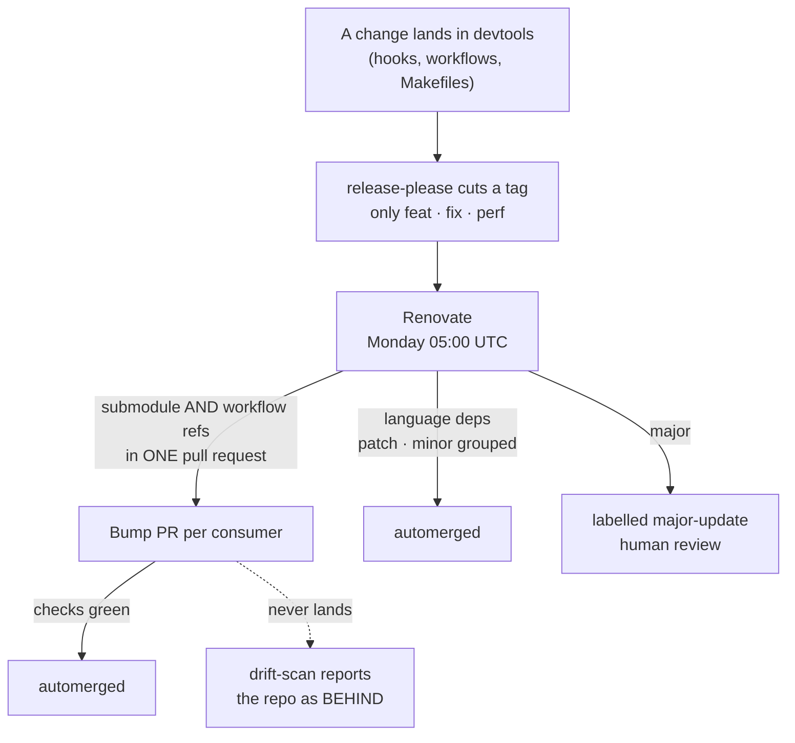

# Dependency updates

How dependency updates reach the eleven `ostara-labs` repositories, who is
allowed to open them, and what merges without a human.



## The three layers, which are not the same thing

Confusing them is what makes a bump look like it "did not work" when it
actually worked and something else did not.

| Layer | What moves | Cadence | Who decides |
|---|---|---|---|
| **devtools pins** | the `.devtools` submodule **and** the `uses:` refs | on every devtools release | Renovate, automerged |
| **Language deps** | `cargo`, `npm`, `pip`, `uv`, `mix` | Monday | Renovate; majors need a human |
| **Propagation** | the tag reaching all ten consumers | follows a release | Renovate, automerged |

A devtools change only reaches consumers **through a tagged release**. A
`ci:` or `chore:` commit passes the hooks, lands on `main`, and cuts nothing —
so no consumer can bump to it. Type anything consumers must receive as
`feat(scope):`, `fix(scope):` or `perf(scope):`.

## Why the submodule and the refs move together

A consumer pins devtools in **two** places:

```
.devtools                                     the submodule gitlink
.github/workflows/*.yml                       uses: ostara-labs/devtools/...@<sha>
```

Moving one without the other leaves the repo in a **split state**: the hooks
come from one devtools commit and the workflows from another. That is exactly
what `drift-scan` exists to detect.

This is why the two pins are matched as one dependency set. Two separate
Dependabot ecosystems cannot do it, which is visible in the history: PR #99 on
`bot` bumped a workflow ref and was **closed unmerged**, because merging it
alone would have produced the split state.

## What merges without a human

| Update type | Behaviour |
|---|---|
| devtools pins (submodule + refs) | **automerged** — every devtools change is human-reviewed at the source, propagation is mechanical |
| `patch` and `minor` language deps | **automerged**, grouped into one PR per ecosystem |
| `major` language deps | **never automerged** — labelled `major-update` |

Majors stay manual on purpose: nothing in this org's CI can tell whether a
semantic major is safe to take. Trading a saved click for a silent breakage is
the wrong trade.

Automerge here is **not** "press the merge button through the ruleset". The
PR still goes through the normal gate; automerge means Renovate will merge it
once the required checks pass.

## Cadence, and why Monday

Renovate runs **Monday 05:00 UTC**, ahead of the weekly `drift-scan` at 05:23.
The ordering is deliberate: the scan should report on a settled tree, not on a
wave half-applied.

A run can be forced by hand (`workflow_dispatch`) after an occasional devtools
change, rather than waiting for Monday.

## When a bump does not arrive

The first thing to check is not the consumer — it is whether a **release**
exists. A fix merged into devtools that was typed `ci:` or `chore:` cuts no
tag, so there is nothing for Renovate to bump to.

Then check the tag itself:

```bash
gh api repos/ostara-labs/devtools/releases/latest --jq .tag_name
```

If the tag is right and a consumer is still behind, the health check will say
so — `drift-scan` reports every repo whose submodule or refs differ from the
latest release, and its failure is **informational**: it exits non-zero when it
finds drift, which is the job working.

## Removing Dependabot

Dependabot is replaced, not supplemented: two bots updating the same
dependency produce competing PRs and two places to change a rule.

The order matters. Dependabot is removed **only after Renovate has produced
PRs**, otherwise repositories would have no updater at all in the gap.
