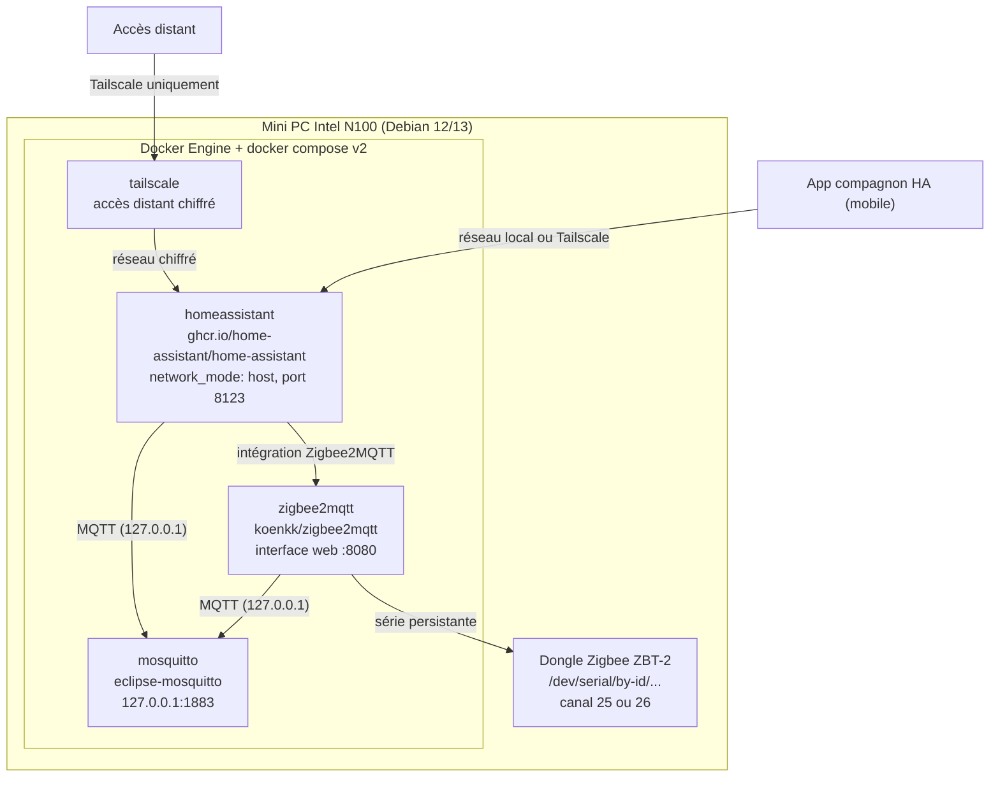
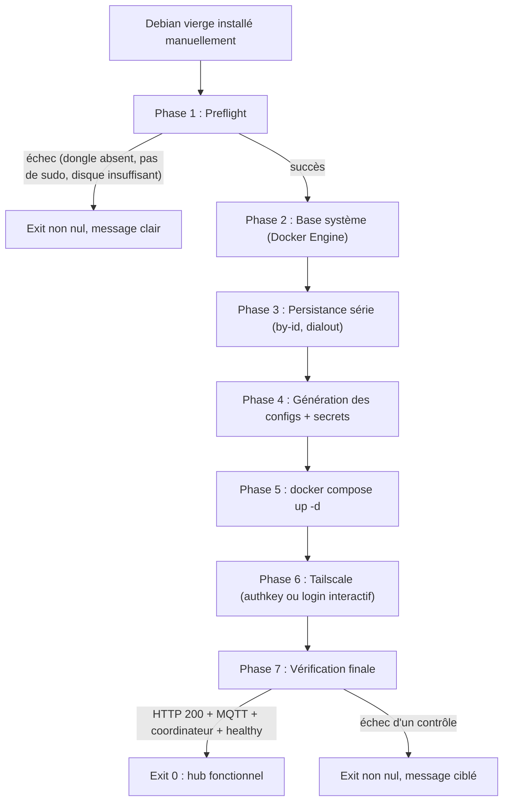

# Spécification d'installation du hub domotique

## TL;DR

Ce document est le cahier des charges du script unique `scripts/install.sh`. Il
décrit comment transformer un Debian 12/13 vierge (installé manuellement sur un
mini PC Intel N100) en un hub domotique local-first fonctionnel, en une seule
commande, en moins de 30 minutes.

La stack est figée : Docker Engine (repo apt officiel) + docker compose v2 avec
quatre services : Home Assistant (socle appareils), Mosquitto (broker MQTT,
lié à 127.0.0.1 uniquement), Zigbee2MQTT (pont Zigbee) et Tailscale (accès
distant, jamais de port forwarding routeur). Le dongle Zigbee (Home Assistant
Connect ZBT-2) est adressé par chemin persistant `/dev/serial/by-id/...`, jamais
par `/dev/ttyUSB0`.

Le script est strictement idempotent : une ré-exécution ne produit aucun
changement destructif. Chaque phase détecte son état déjà-fait et saute.

## Architecture cible

Le hub est un ensemble de conteneurs Docker orchestrés par docker compose v2,
tournant sur un seul mini PC. Home Assistant utilise `network_mode: host` et
expose son interface sur le port 8123. Mosquitto n'écoute que sur l'interface
de boucle locale (127.0.0.1:1883), donc aucun autre appareil du réseau local ne
peut le joindre. Zigbee2MQTT pilote le dongle Zigbee via le chemin série
persistant et expose une interface web sur le port 8080. Tailscale fournit
l'accès distant chiffré, sans aucune ouverture de port sur le routeur.

Le dongle Zigbee est branché via une rallonge USB 2.0, dédié au Zigbee, sur le
canal 25 ou 26 (le Wi-Fi occupe les canaux 1, 6 et 11). Le fuseau horaire est
`Europe/Paris`.

### Choix architectural : HA Container plutôt que HAOS

Home Assistant est déployé en conteneur Docker (image officielle
`ghcr.io/home-assistant/home-assistant`), et non en HAOS (appliance flashée).
La raison est décisive pour ce projet : HAOS résiste au provisioning scripté,
car il s'agit d'un système d'exploitation complet à flasher, alors qu'une stack
Docker Compose se prête à une installation idempotente en une seule commande.
Ce choix est cohérent avec un autre projet du même propriétaire (pia-mvp, déjà
en Docker Compose).

La limite doit être dite honnêtement : il n'y a pas de store d'add-ons HAOS.
Mosquitto et Zigbee2MQTT tournent donc en conteneurs voisins, ce qui est un
pattern standard et documenté. ESPHome et Frigate pourront être ajoutés plus
tard comme services compose supplémentaires, sans toucher à l'existant.

## Prérequis humains

Ces étapes sont manuelles et ne sont pas automatisables. Elles doivent être
faites avant de lancer le script.

1. **Installer Debian 12/13** sur le mini PC Intel N100, en netinst minimal.
   Créer un utilisateur avec les droits sudo pendant l'installation.
2. **Brancher le dongle Zigbee** (Home Assistant Connect ZBT-2) via une
   rallonge USB 2.0. Vérifier qu'il est détecté (`lsusb` doit montrer un
   périphérique Silicon Labs).
3. **Raccorder le mini PC au réseau** avec une connexion internet correcte.
4. **Préparer le fichier `.env`** à partir du template `.env.example` (voir
   section Contrat du script, entrées).
5. **Récupérer une clé d'authentification Tailscale** si l'on veut un accès
   distant sans interaction (optionnel ; sinon le script affiche l'URL de
   login interactive).

Le matériel et ses pièges sont détaillés dans la
[référence matérielle](spec-materiel.md).

## Contrat du script `scripts/install.sh`

Le script n'existe pas encore. Cette section est son cahier des charges. Il
s'exécute depuis un Debian vierge, en une seule commande, et doit aboutir à un
hub fonctionnel en moins de 30 minutes sur une connexion correcte.

### Mode d'exécution recommandé

Deux options sont possibles :

- `curl -fsSL <url>/install.sh | bash` : une seule ligne, mais le contenu n'est
  pas auditable avant exécution et le pipe vers `bash` masque les erreurs
  intermédiaires.
- `git clone <repo> && ./install.sh` : **recommandé**. Le script est présent
  localement, lisible et auditable avant exécution, et les erreurs sont
  visibles. C'est le mode retenu.

### Entrées

Le script lit un fichier `.env` à la racine du dépôt, généré à partir du
template committé `.env.example`. Le vrai `.env` est gitignoré.

| Variable | Défaut | Rôle |
|---|---|---|
| `TZ` | `Europe/Paris` | Fuseau horaire injecté dans les conteneurs |
| `ZIGBEE_CHANNEL` | `25` | Canal Zigbee (25 ou 26) |
| `TAILSCALE_AUTHKEY` | vide | Clé d'authentification Tailscale ; si vide, le script affiche l'URL de login interactive |
| `HOSTNAME` | vide | Nom d'hôte optionnel du mini PC |

Le script résout aussi `DONGLE_PATH` (chemin série persistant) et l'écrit dans
`.env` à la phase 3.

### Phases

Le script se déroule dans l'ordre suivant, avec une journalisation lisible
phase par phase.

**Phase 1 : Preflight.** Vérifier l'architecture x86_64, la connexion internet,
les droits sudo, l'espace disque disponible (au moins 10 Go) et la présence du
dongle Zigbee (`lsusb`, ID vendor/product Silicon Labs). En cas d'absence du
dongle, échec explicite avec un message clair, avant toute modification du
système.

**Phase 2 : Base système.** Installer les paquets apt nécessaires, puis Docker
Engine depuis le repo apt officiel Docker. Idempotent : si Docker est déjà
présent, l'installation est sautée. Ajouter l'utilisateur au groupe `docker`.

**Phase 3 : Persistance série.** Créer la règle udev et le symlink vers
`/dev/serial/by-id`, ajouter l'utilisateur au groupe `dialout`, résoudre
`DONGLE_PATH` et l'écrire dans `.env`.

**Phase 4 : Génération des configs.** Rendre les templates du repo
(`mosquitto.conf`, `zigbee2mqtt/configuration.yaml` avec canal et chemin du
dongle injectés, `homeassistant/configuration.yaml` minimal) vers
`./config/<service>/`. Générer les secrets une seule fois (`openssl rand`) et
les stocker hors git.

**Phase 5 : Déploiement.** Lancer `docker compose up -d`.

**Phase 6 : Tailscale.** `up --authkey` si une clé est fournie, sinon mode
login interactif avec affichage de l'URL.

**Phase 7 : Vérification finale.** Vérifier le HTTP 200 sur
`http://localhost:8123`, la réponse de Mosquitto sur le port 1883 localhost, la
détection du coordinateur par Zigbee2MQTT et l'état healthy de tous les
conteneurs. En cas de succès, exit code 0. En cas d'échec, message ciblé et
exit code non nul.

### Idempotence stricte

La ré-exécution du script ne doit produire aucun effet destructif. Chaque phase
détecte son état déjà-fait et saute. C'est un critère Given-When-Then obligatoire
(voir REQ-INS-002).

### Vérification

La phase 7 est la porte de sortie du script. Elle détermine le code de retour
final. Aucun succès n'est déclaré tant que les quatre contrôles ne passent pas.

## Diagramme du flux d'installation

## Exigences REQ-INS-NNN

Chaque exigence est exprimée en Given-When-Then (Étant donné / Quand / Alors).

### REQ-INS-001 : Debian vierge vers hub fonctionnel en une commande

- **Étant donné** un Debian 12/13 vierge avec un utilisateur sudo, le dongle
  Zigbee branché et un `.env` préparé,
- **Quand** on exécute `git clone <repo> && ./install.sh`,
- **Alors** le hub est fonctionnel en moins de 30 minutes sur une connexion
  correcte, avec les quatre services démarrés et l'interface Home Assistant
  accessible sur `http://localhost:8123`.

### REQ-INS-002 : Ré-exécution sans changement destructif

- **Étant donné** un hub déjà installé et fonctionnel,
- **Quand** on ré-exécute `./install.sh`,
- **Alors** aucune phase ne produit d'effet destructif : chaque phase détecte
  son état déjà-fait et saute, les conteneurs existants ne sont pas recréés
  inutilement, et le hub reste fonctionnel avec un exit code 0.

### REQ-INS-003 : Dongle absent, échec propre avant toute modification

- **Étant donné** un Debian vierge sans dongle Zigbee branché,
- **Quand** on exécute `./install.sh`,
- **Alors** le script échoue à la phase Preflight avec un message clair
  indiquant l'absence du dongle, et aucun paquet n'est installé, aucune
  configuration n'est générée, aucun conteneur n'est lancé.

### REQ-INS-004 : Secrets jamais dans git

- **Étant donné** un `.env` et des secrets générés par le script,
- **Quand** on inspecte le dépôt versionné,
- **Alors** aucun secret (clé Tailscale, mots de passe, secrets HA) n'apparaît
  dans git : `.env` et `secrets/` sont gitignorés, et seuls les templates
  `.env.example` et les configs sans secret sont suivis.

### REQ-INS-005 : Ports jamais exposés sur le réseau local hors Tailscale

- **Étant donné** le hub déployé,
- **Quand** on scanne les ports du mini PC depuis un autre appareil du réseau
  local,
- **Alors** aucun port n'est ouvert sur l'interface réseau : Mosquitto est lié
  à `127.0.0.1:1883` uniquement, et l'accès distant passe exclusivement par
  Tailscale, sans port forwarding routeur.

### REQ-INS-006 : Authentification Home Assistant obligatoire

- **Étant donné** le hub déployé,
- **Quand** on accède à l'interface Home Assistant,
- **Alors** l'authentification est obligatoire (jamais de mode trust auth), et
  le premier accès passe par l'onboarding wizard de création du compte admin.

### REQ-INS-007 : Dongle adressé par chemin persistant

- **Étant donné** le dongle Zigbee branché,
- **Quand** on redémarre le mini PC,
- **Alors** le dongle est toujours adressé par le même chemin
  `/dev/serial/by-id/...`, jamais par `/dev/ttyUSB0`, et Zigbee2MQTT retrouve
  le coordinateur sans reconfiguration.

## Étapes post-install manuelles

Ces étapes ne sont pas automatisables et sont documentées ici pour l'opérateur.

1. **Onboarding Home Assistant** : au premier accès `http://<ip>:8123`, créer le
   compte administrateur via le wizard HA.
2. **Appairage de l'app mobile** : installer l'app compagnon HA officielle et
   la connecter au hub (réseau local ou Tailscale).
3. **Appairage des appareils Zigbee** : via l'interface Zigbee2MQTT ou
   l'intégration HA, mettre les appareils en mode appairage et les associer.
4. **Vérification du canal Zigbee** : confirmer que le canal choisi (25 ou 26)
   ne chevauche pas le Wi-Fi (canaux 1, 6, 11).

## Sécurité et limites d'usage

### Toujours

- Adresser le dongle par `/dev/serial/by-id/...`.
- Garder Mosquitto lié à `127.0.0.1`.
- Passer par Tailscale pour tout accès distant.
- Conserver les secrets hors git.
- Garder l'authentification Home Assistant active.

### Demander d'abord

- **Changer le canal Zigbee après appairage d'appareils** : cela impose un
  ré-appairage complet de tous les appareils. À ne faire qu'avec l'accord
  explicite de l'opérateur.
- **Ajouter Z-Wave / ZWA-2** : nouveau matériel radio, nouvelle intégration,
  à valider avant.
- **Toute exposition réseau au-delà de Tailscale** : ouvrir un port sur le
  réseau local ou le routeur est une décision à valider explicitement.

### Jamais

- **Port forwarding routeur** : l'accès distant passe uniquement par Tailscale.
- **Secrets committés** : aucun secret dans git.
- **Désactiver l'authentification Home Assistant** : jamais de mode trust auth.

## Glossaire

| Terme | Définition |
|---|---|
| HAOS | Appliance Home Assistant complète, flashée sur le matériel |
| HA Container | Home Assistant exécuté dans un conteneur Docker |
| Dongle Zigbee | Radio USB (Home Assistant Connect ZBT-2) pilotant les appareils Zigbee |
| Coordinateur | Rôle du dongle dans le réseau Zigbee |
| Broker MQTT | Mosquitto, transport des messages entre les services |
| `network_mode: host` | Le conteneur partage le réseau de l'hôte |
| `by-id` | Chemin série persistant, stable au redémarrage |
| Tailscale | Réseau privé chiffré (WireGuard) pour l'accès distant |

## Références croisées

- [Référence matérielle](spec-materiel.md) : BOM et pièges matériel (dongle,
  rallonge USB, canal Zigbee).
- `.env.example` : template des variables d'entrée du script.
- `scripts/install.sh` : le script dont ce document est le cahier des charges
  (à implémenter).
- `docker-compose.yml` : définition des quatre services (à implémenter).
- `config/` : configs générées à l'installation (templates dans le repo,
  instances générées non suivies).
